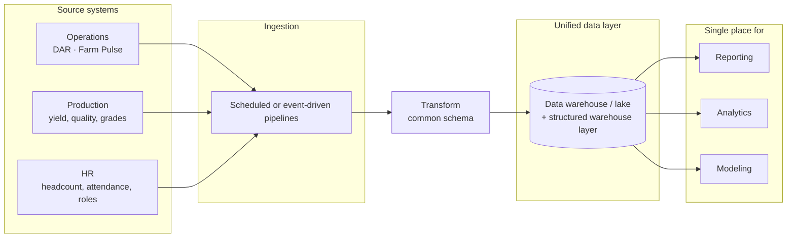
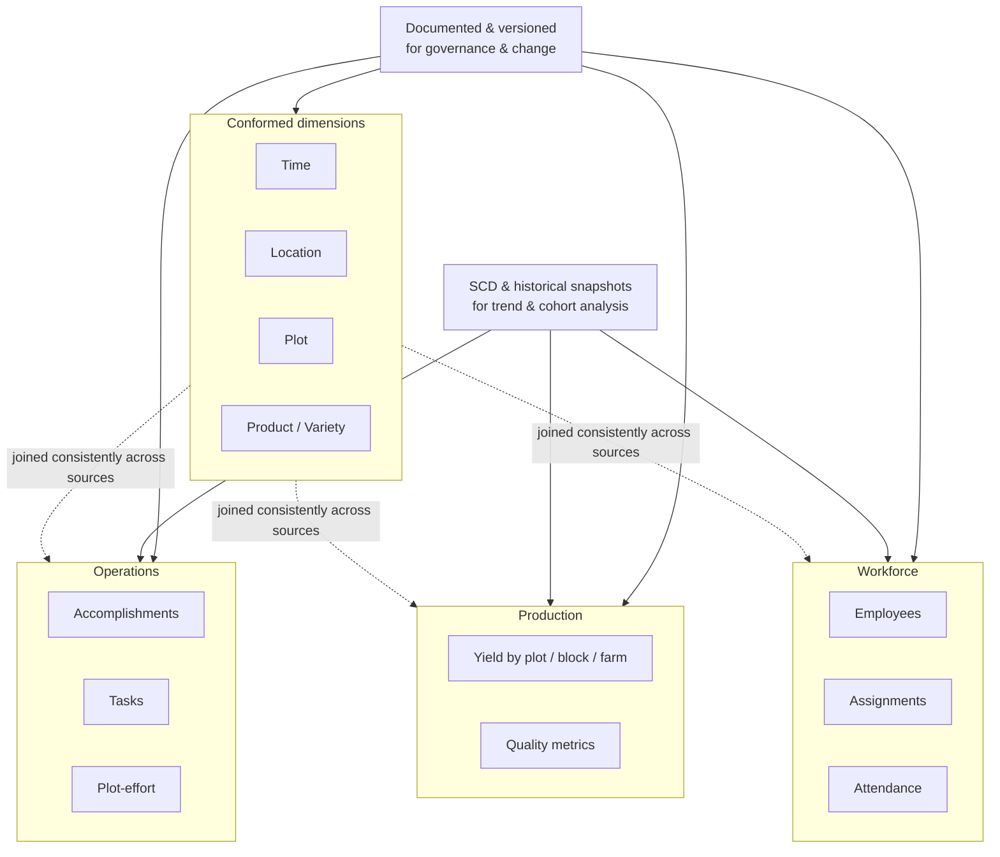
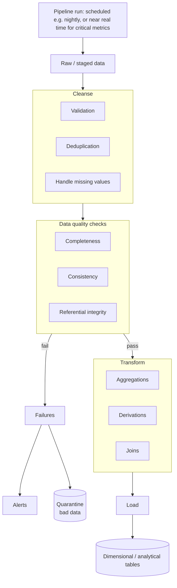
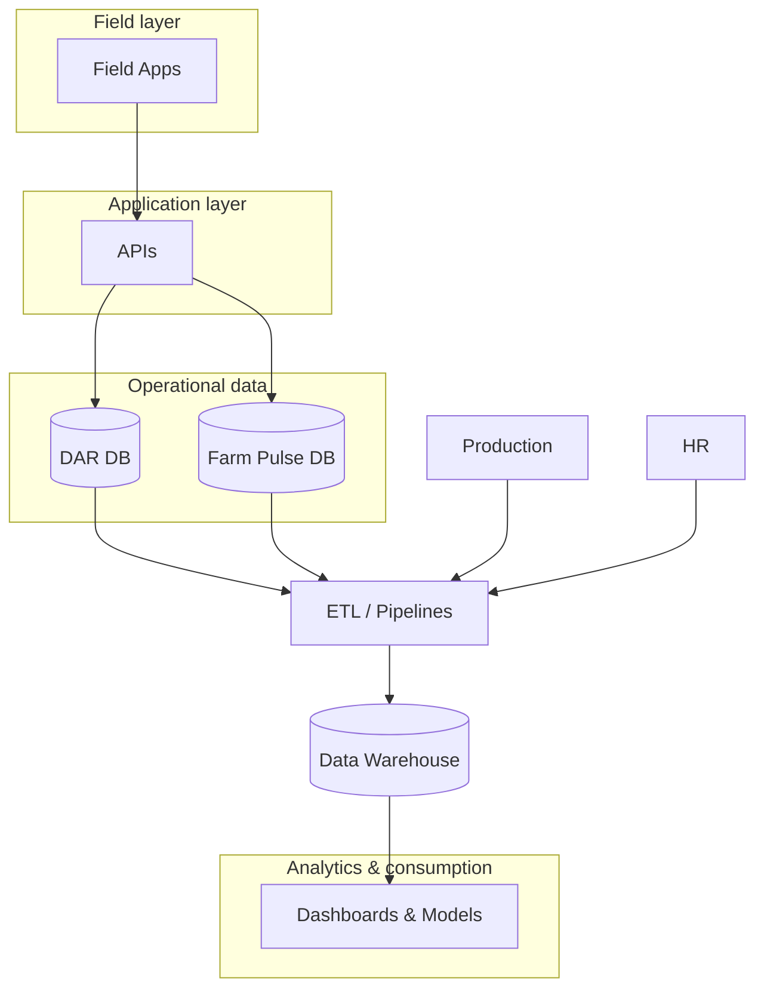

# Digital Transformation for Farms: A Phased Data-Driven Evolution

**A strategic whitepaper for investors, enterprise farm operators, and government agencies**

---

## 1. Executive Summary

Agriculture remains one of the least digitized major sectors. Farm operators routinely make critical decisions—from labor allocation to input application to harvest timing—on the basis of paper trails, spreadsheets, and tribal knowledge. As margins tighten, climate variability increases, and labor becomes scarcer, the cost of this opacity grows. Digital transformation in agriculture is no longer optional; it is the pathway to resilience, productivity, and sustainable yield.

This whitepaper presents a **phased, data-driven evolution** for farm operations: from **reporting** (knowing what was done), through **visibility** (knowing where and by whom), to **intelligence** (understanding patterns and outcomes), and finally to **predictability** (forecasting and decision support). The program is designed to be implemented in three phases, each building on the last, minimizing risk and maximizing measurable return.

**Phase 1 — DAR (Daily Accomplishment Report)** establishes the foundation: daily accomplishment tracking at the people and group level. It replaces manual logs with structured, operational data tied to manpower and tasks. **Phase 2 — Farm Pulse** extends that foundation to the plot and land level, delivering granular operational traceability and connecting effort to specific land units. **Phase 3 — Data Warehouse & Intelligence** unifies operations, production, and HR data into a single analytical layer, enabling dashboards, forecasting, and predictive models that support strategic and tactical decisions.

The ultimate goal is to transition farms from manual reporting to **predictive, insight-driven agricultural management**—without big-bang replacement. Each phase delivers standalone value and prepares the organization for the next. This document outlines the industry problem, the vision, the architecture, the business case, and the implementation roadmap to get there.

---

## 2. Industry Problem Statement

Farm operations today face structural barriers to efficiency and insight. The following problems are pervasive and directly addressed by a phased digital transformation.

### Fragmented Farm Data

Operational data (what was done, by whom, when) often lives in separate systems, spreadsheets, or paper forms from production data (yield, quality, inputs per area). HR and labor data may sit in yet another system. There is no single source of truth. Reconciling “who worked where” with “what was produced where” requires manual correlation and is frequently not done at all. Fragmentation blocks any meaningful analytics and prevents operators from answering basic questions such as labor productivity per plot or cost per hectare by activity.

### Manual Reporting Limitations

Daily accomplishment reporting is still largely manual: supervisors fill paper forms or ad hoc spreadsheets, which are later keyed into systems or filed. This creates delays, transcription errors, and limited structure. Data arrives too late for same-day decisions and is often incomplete or inconsistent. Manual reporting also consumes supervisor time that could be spent on coordination and quality oversight.

### Lack of Predictive Capability

Most farms operate in a reactive mode. Decisions about labor deployment, input application, and harvest scheduling are based on experience and rules of thumb rather than on models fed by current data. There is little or no use of forecasting (e.g., yield, labor demand, input needs) or predictive analytics (e.g., risk of shortfall, optimal timing). The result is suboptimal allocation of resources and higher exposure to volatility.

### Productivity Opacity

Without structured, timely data on accomplishments by task, location, and crew, productivity is opaque. It is difficult to compare performance across teams, blocks, or seasons, or to identify best practices and bottlenecks. Incentives cannot be aligned to measurable outcomes, and improvement initiatives lack a baseline.

### Decision-Making Delays

When data is manual and fragmented, decisions are delayed. By the time information is collected, entered, and summarized, the window for corrective action has often closed. Real-time or near-real-time visibility into what is happening in the field is rare, limiting the ability to reallocate labor, adjust inputs, or respond to weather and market conditions.

Together, these issues constrain profitability, scalability, and sustainability. A phased digital program that starts with structured daily reporting, moves to plot-level visibility, and culminates in an intelligence layer directly addresses each of these problems.

---

## 3. Vision: The Digitally Enabled Farm

A **digitally enabled farm** is one where every material decision is informed by accurate, timely, and actionable data. The vision can be summarized in four dimensions.

**Reporting is automatic and structured.** Supervisors capture daily accomplishments through a purpose-built interface (mobile and web). Data is recorded once, at the source, in a consistent schema. No re-keying, no paper backlog. Reports—by crew, by operation, by location—are generated from the same system, ensuring consistency and auditability.

**Visibility is granular.** Management can see not only what was accomplished in aggregate but *where* (plot, block, farm) and *by whom* (crew, individual where relevant). Effort is tied to land units. This enables operational traceability: from task to location to eventual production, creating the basis for productivity analysis and accountability.

**Intelligence is centralized.** Operations, production, and HR data flow into a unified data layer. Dashboards surface key performance indicators—labor productivity, input efficiency, yield trends—to the right roles. Data is cleaned, normalized, and governed so that analytics and models rest on a reliable foundation.

**Predictability is built in.** Forecasting and predictive models use historical and current data to project yields, labor needs, input requirements, and risks. Decision-support systems help managers allocate resources, schedule activities, and respond to early warning signals. The farm shifts from reactive to proactive management.

The transformation is a journey: reporting → visibility → intelligence → predictability. Each phase adds a layer of capability without discarding the previous one. The digitally enabled farm is the end state—achievable through the phased program described in the following sections.

---

## 4. Phase-by-Phase Architecture

### Phase 1 — DAR (Foundation Layer)

**Objectives**

Phase 1 establishes the foundation for all subsequent phases. Its objectives are to (1) replace manual daily accomplishment reporting with a structured, digital process; (2) capture operational data at the people/group level in a consistent, queryable form; and (3) create a single system of record for “what was done, by whom, when” that can later be joined with plot and production data.

**Current Capabilities**

DAR (Daily Accomplishment Report) is an existing system comprising a backend API (DAR_Middleware, Node/Express, MSSQL) and a mobile input interface (main_dar_app, Flutter). Farm supervisors use the app to record daily accomplishments by operation type. Supported operations include fruit care, bagging, gouging, harvest, fertilization, chemical mixing, survey, utility, MPS, and others. Data is captured as batches with headers, details, accomplishments, and materials. Reference data—locations, parcels, materials, layouts, employees, operation config—is synced from the backend so that supervisors select from controlled values. User authentication, batch and document numbering, and automatic calculation of totals (e.g., quantities, batch-level accomplishments) are implemented. Form submission and sync APIs are in place per operation type, providing a stable base for reporting and for future integration with plot-level and intelligence layers.

**Limitations**

DAR today tracks accomplishments at the **people/group level** (crew, batch), not at the **plot/land level**. It answers “what did this crew do today?” but not “what was done on this specific plot?” Geographic and land-unit granularity are limited to what is in the header or reference data, not systematically tied to every accomplishment. Reporting is therefore strong for workforce productivity and operational volume, but cannot yet support plot-level traceability or link effort directly to land units for yield and input analysis. These extensions are the focus of Phase 2.

**Value Delivered**

Phase 1 delivers immediate value: elimination of paper-based daily reporting, reduction of transcription errors, faster availability of data for operations and management, and a single source of truth for daily accomplishments. It also creates the data foundation—structured, consistent, and accessible via API—required for Phase 2 and Phase 3. ROI is realized through labor time saved, fewer errors, and better compliance and auditability.

---

### Phase 2 — Farm Pulse (Granular Operational Intelligence)

**System Overview**

Farm Pulse is a new mobile and web application layer that sits alongside (and integrates with) DAR. It shifts the unit of tracking from **people/group** to **plot/land**. Where DAR answers “what did the crew accomplish today?”, Farm Pulse answers “what was accomplished on this plot (or block) today?” It is designed for operational traceability per plot and for connecting manpower effort to specific land units, bridging operational execution with production performance.

**Plot-Level Tracking Model**

Accomplishments are recorded with an explicit link to plot (or block) identifiers. Every task—harvest, fertilization, spraying, pruning, etc.—is associated with a land unit. This allows aggregation by plot over time: total labor hours, total inputs applied, number of passes, and eventually correlation with production (yield, quality) per plot. The data model extends the DAR-style batch/header/detail/accomplishment structure with mandatory plot (or land-unit) dimensions and supports mobile-first data entry in the field (e.g., supervisor selects plot, then records what was done there).

**Mobile-First Design Considerations**

Field users need to capture data where work happens. Farm Pulse is designed mobile-first: responsive forms, offline-capable entry where connectivity is poor, sync when back online, and clear navigation by location (farm → block → plot) so that supervisors can quickly select the correct land unit and log accomplishments. Role-based access ensures that only authorized users see or edit data for their scope (e.g., by farm or region). Usability is prioritized to minimize training and adoption friction.

**Operational Impact**

Farm Pulse enables managers to see effort and inputs at the plot level. This supports: (1) **Traceability**—linking every material operation to a specific piece of land for compliance and quality; (2) **Productivity analysis**—comparing labor and input efficiency across plots and crews; (3) **Preparation for yield correlation**—when production data is integrated in Phase 3, plot-level operations data becomes the explanatory variable for yield and quality. Operations and production are no longer disconnected.

**Data Structure Evolution**

Phase 2 introduces or formalizes entities such as plot, block, and farm as first-class dimensions in the operational model. Accomplishment and detail records carry foreign keys to these dimensions. APIs and sync mechanisms are extended to support plot-level reads and writes and to expose this structure to the future data warehouse. Data quality rules (e.g., plot must be valid, within block/farm hierarchy) are enforced at capture time to keep the intelligence layer clean.

---

### Phase 3 — Intelligence & Data Warehousing

**Data Consolidation Model**

Phase 3 introduces a unified data layer that integrates operations data (from DAR and Farm Pulse), production data (yield, quality, grades), and HR data (headcount, attendance, roles). Data is ingested from source systems via scheduled or event-driven pipelines, transformed into a common schema, and stored in a dedicated warehouse (or data lake with a structured warehouse layer). This becomes the single place for reporting, analytics, and modeling.

**Schema Strategy**

The warehouse schema is designed around core subject areas: operations (accomplishments, tasks, plot-effort), production (yield by plot/block/farm, quality metrics), and workforce (employees, assignments, attendance). Conformed dimensions (time, location, plot, product/variety) are used so that facts from different sources can be joined consistently. Historical snapshots and slowly changing dimensions are applied where needed for trend and cohort analysis. The schema is documented and versioned to support governance and change management.

**Analytics Pipeline**

Raw or staged data is cleansed (validation, deduplication, handling of missing values), transformed (aggregations, derivations, joins), and loaded into dimensional or analytical tables. The pipeline runs on a schedule (e.g., nightly) or in near real time for critical metrics. Data quality checks (completeness, consistency, referential integrity) are part of the pipeline; failures trigger alerts and optional quarantine of bad data so that downstream analytics are not polluted.

**Forecasting Capabilities**

The intelligence layer supports forecasting of yields, labor demand, and input needs. Models use historical operations and production data, optionally enriched with weather and market data. Outputs are consumed by dashboards and by operational planning tools. Forecasts are updated periodically and validated against actuals to improve accuracy over time.

**Predictive Modeling Approach**

Beyond forecasting, predictive models can address questions such as: risk of yield shortfall by plot, optimal timing for inputs, or likelihood of quality issues. Models are trained on warehouse data and deployed as services or batch jobs. Results are surfaced through dashboards or decision-support workflows. The approach is iterative: start with a few high-value use cases and expand as data quality and adoption improve.

**Dashboarding Strategy**

Role-based dashboards provide insight to field supervisors, operations managers, and executives. Examples: daily accomplishments by crew and by plot; productivity (e.g., output per labor-hour) by block; yield trends and forecasts; labor and input cost per hectare. Dashboards are built on the warehouse and use consistent definitions and KPIs. Access is controlled by role and, where applicable, by geography or business unit.

**Governance & Data Quality**

Data governance defines ownership, stewardship, and quality expectations for each source and subject area. Quality rules are implemented in the pipeline and monitored (e.g., completeness rates, exception reports). Master data (plots, varieties, employees) is maintained in authoritative sources and synchronized to the warehouse. This ensures that analytics and models rest on reliable, agreed-upon data.

---

## 5. Technical Architecture Overview

**System Diagram (Textual Description)**

- **Field layer:** Mobile (e.g., Flutter) and web clients used by supervisors and field staff. They connect to the backend over HTTPS.
- **Application/API layer:** DAR_Middleware (Node/Express) handles DAR form submission, user auth, and sync APIs. Farm Pulse, when implemented, may be served by the same or a separate API layer that exposes plot-level endpoints and integrates with DAR where appropriate.
- **Data layer:** Operational databases (e.g., MSSQL for DAR) store transactional data. In Phase 3, a data warehouse (or lakehouse) ingests from these sources plus production and HR systems, and stores normalized/aggregated data for analytics.
- **Analytics layer:** ETL/ELT pipelines, forecasting and predictive models, and dashboard/reporting services run on top of the warehouse. Outputs feed back into operational tools (e.g., labor allocation recommendations) where desired.

Data flows **from field capture → API → operational DB** for DAR and Farm Pulse; and **from operational DB (and other sources) → pipeline → warehouse → analytics and dashboards** in Phase 3. The following diagram summarizes the end-to-end flow:

**Data Flow**

- **Capture:** Supervisors submit accomplishments via mobile or web to the API; data is validated and persisted in the operational database. Reference data is synced from API to clients as needed.
- **Integration:** In Phase 3, operational, production, and HR data are extracted (batch or incremental), transformed (cleansing, mapping, aggregation), and loaded into the warehouse. Processed data is then available for reporting and modeling.
- **Consumption:** Reports and dashboards query the warehouse (or cached aggregates). Forecasting and predictive models read from the warehouse and write results to tables or APIs for display and decision support.

**API Structure**

DAR today exposes REST APIs for form submission (`/sendDARForm/*`), user management (`/user/*`), reporting (`/report/*`), and sync (`/api/*` for reference data). Farm Pulse would expose similar REST (or GraphQL) endpoints for plot-level CRUD and sync. The warehouse layer may expose read-only APIs or direct SQL/OLAP access for approved analytics tools. Authentication and authorization are applied consistently across APIs (e.g., token-based, role-based access).

**Data Normalization Approach**

In the operational systems, normalization follows existing DAR design (batch, header, detail, accomplishment, materials per operation). In the warehouse, a star or snowflake schema is used: conformed dimensions (time, location, plot, product, workforce) and fact tables (accomplishments, yield, costs). Normalization in the warehouse is geared to query performance and analytical clarity rather than transaction processing. Master data is normalized in source systems and reflected in the warehouse via conformed dimensions.

**Security Considerations**

- **Authentication:** User login and token-based API access; support for SSO where required.
- **Authorization:** Role-based access so that users see only data within their scope (e.g., by farm, region, or role).
- **Data in transit:** TLS for all client–server and inter-service communication.
- **Data at rest:** Database and warehouse encryption as per policy; sensitive fields (e.g., PII) masked or restricted in analytics.
- **Audit:** Logging of access and changes to critical data for compliance and troubleshooting.

**Scalability Model**

APIs and databases are scaled horizontally or vertically as load grows (e.g., more API instances behind a load balancer, database tuning or read replicas). The warehouse and pipeline are designed for incremental and batch loads; real-time streaming can be added later if needed. Mobile clients support offline capture and sync to handle poor connectivity, reducing peak load during sync windows.

---

## 6. Business & Financial Impact

**ROI Framework**

Return on investment is measured along three dimensions: (1) **Cost reduction**—less time on manual reporting, fewer errors, lower cost of compliance and audit; (2) **Productivity gains**—better allocation of labor and inputs thanks to visibility and, in Phase 3, to forecasting and optimization; (3) **Revenue protection and growth**—better yield and quality through data-driven decisions and early response to issues. Benefits are phased: Phase 1 yields mainly cost and compliance benefits; Phase 2 adds productivity and traceability; Phase 3 adds forecasting and strategic optimization. Costs include implementation (software, integration, change management), run (licenses, infrastructure, support), and ongoing data governance. ROI is computed per phase and cumulatively, with sensitivity analysis on adoption and usage assumptions.

**Productivity Gains**

Structured daily reporting (Phase 1) reduces time spent on paperwork and reconciliation. Plot-level visibility (Phase 2) enables identification of best-performing plots and crews and replication of best practices; it also reduces time spent searching for “what was done where.” Intelligence and forecasting (Phase 3) allow labor and inputs to be allocated where they have the highest impact, improving output per unit of input. Gains are expressed as percentage improvement in labor productivity (e.g., output per labor-hour) or in operational throughput (e.g., area covered per day) with targets set per phase.

**Cost Optimization**

Elimination of duplicate data entry and manual reconciliation lowers administrative cost. Fewer errors mean less rework and fewer compliance incidents. Over time, better forecasting of labor and input needs reduces overstaffing and over-purchasing. Cost optimization is tracked via metrics such as cost per hectare (labor + inputs), cost of reporting and data management, and cost of non-compliance or rework.

**Waste Reduction**

Visibility into where inputs (fertilizer, chemicals) were applied and in what quantity supports precise application and reduces over-application and runoff. Correlation with yield (Phase 3) helps identify under- or over-fertilized areas and adjust programs. Waste reduction is measured in input use per unit output (e.g., fertilizer per ton yield) and in environmental or compliance metrics where applicable.

**Labor Efficiency Improvements**

Phase 1 improves labor efficiency by reducing non-productive time on reporting. Phase 2 allows supervisors and managers to see labor deployment by plot and to reallocate based on priority. Phase 3 can recommend labor allocation based on forecasted demand and historical productivity. Metrics include labor hours per unit output, labor cost per hectare, and supervisor time spent on data entry vs. coordination.

**Yield Forecasting Benefits**

Phase 3 yield forecasts support: (1) **Planning**—harvest scheduling, logistics, and labor; (2) **Marketing**—forward sales and contract fulfillment; (3) **Risk management**—early identification of shortfall or surplus. Benefits are quantified in terms of reduced planning error, better fulfillment rates, and lower cost of last-minute adjustments.

---

## 7. Change Management & Adoption Strategy

**Farmer Onboarding**

Farm owners and senior management must see the program as strategic, not as an IT project. Onboarding includes clear communication of the vision (reporting → visibility → intelligence → predictability), the phased roadmap, and the expected benefits. Early wins from Phase 1 (e.g., faster reports, less paperwork) are highlighted to build momentum. Training and support are provided for new workflows and tools, with feedback channels to capture issues and improve adoption.

**Field Supervisor Enablement**

Supervisors are the primary users of DAR and Farm Pulse. They need to be enabled, not burdened. Training is practical: how to capture data quickly, how to sync, how to correct errors. Mobile UX is optimized for field conditions (gloves, sunlight, connectivity). Supervisors are involved in design and testing so that the tools fit their workflow. Their time savings and reduced frustration are measured and communicated to sustain adoption.

**Data Literacy Strategy**

As the organization moves from reporting to analytics and forecasting, data literacy becomes important. Roles are trained on how to read dashboards, interpret KPIs, and use forecasts in planning. A small cadre of power users or analysts can support the rest. Documentation and glossaries (e.g., definition of “productivity” or “plot”) ensure consistent interpretation. Data literacy is built incrementally, starting with Phase 1 reports and expanding as Phase 2 and 3 capabilities roll out.

**Incentive Alignment**

Incentives are aligned with data quality and usage: for example, recognition for timely and accurate reporting, or performance reviews that incorporate productivity and traceability metrics derived from the system. Misaligned incentives (e.g., rewarding speed over accuracy) are identified and adjusted. The goal is to make “good data” and “good use of data” part of the culture.

---

## 8. Risk Assessment

**Data Integrity Risks**

Incorrect or incomplete data undermines analytics and models. Mitigations include validation at capture (e.g., plot must exist, quantities within range), data quality checks in the pipeline, and clear ownership and stewardship. Training and incentives support accurate entry. Where data is historically poor, Phase 3 rollout may be phased by region or use case until quality is sufficient.

**Adoption Resistance**

Users may resist new tools or processes. Mitigations include early involvement in design, visible senior sponsorship, demonstration of quick wins, and addressing concerns (e.g., “this will take more time”) with evidence (e.g., time studies showing net time savings). Resistance is monitored through usage metrics and feedback; additional support or process tweaks are applied where needed.

**Infrastructure Limitations**

Connectivity in rural areas may be weak. Mobile apps are designed for offline capture and sync when online. Server and database capacity are planned for peak load (e.g., end-of-day sync). Redundancy and disaster recovery are defined for critical systems. Where infrastructure is a constraint, rollout may be phased by geography.

**Forecasting Inaccuracies**

Models may be wrong, especially early on. Mitigations include: conservative use of forecasts (e.g., as one input among others), validation against actuals and iteration of models, clear communication of uncertainty (e.g., ranges rather than point estimates), and human oversight for material decisions. Forecasting is positioned as decision support, not replacement of judgment.

---

## 9. Implementation Roadmap

**Timeline by Phase**

- **Phase 1 (DAR):** In place; focus is on stabilization, rollout to remaining users, and merge to main/DEV. Timeline: 0–6 months from program start (or as per current release plan).
- **Phase 2 (Farm Pulse):** Design and build plot-level tracking, mobile and web UX, and integration with DAR. Pilot in one or two farms or regions, then scale. Timeline: approximately 6–18 months from program start, depending on scope and resources.
- **Phase 3 (Intelligence & Warehouse):** Design warehouse schema and pipelines; integrate DAR, Farm Pulse, production, and HR; deploy initial dashboards and forecasting use cases. Timeline: approximately 18–36 months from program start, with incremental delivery of dashboards and models.

**Dependencies**

- Phase 2 depends on Phase 1 being stable and widely adopted so that plot-level data can build on a solid accomplishment base.
- Phase 3 depends on Phase 2 for plot-level operational data and on availability of production and HR data in integrable form. Data governance and quality must be in place for the warehouse to be trusted.

**Milestones**

- **M1:** Phase 1 fully deployed; DAR the default for daily accomplishment reporting; sync and reporting stable.
- **M2:** Farm Pulse design approved; pilot launched in at least one region.
- **M3:** Farm Pulse rolled out to target geography; plot-level data flowing.
- **M4:** Warehouse and pipelines live; first dashboards and at least one forecasting use case in production.
- **M5:** Full suite of dashboards and predictive use cases; governance and quality processes operational.

**KPIs per Phase**

- **Phase 1:** % of daily accomplishments captured in DAR; time from work done to report available; error rate (e.g., rejections or corrections); user satisfaction (e.g., survey).
- **Phase 2:** % of accomplishments with valid plot linkage; adoption (active users, captures per week); traceability coverage (% of plots with at least one accomplishment in period); time to answer “what was done on plot X?”
- **Phase 3:** Data freshness (latency from source to warehouse); dashboard usage; forecast accuracy (e.g., MAPE for yield); number of decisions supported by dashboards or models; data quality scores (completeness, consistency).

---

## 10. Conclusion

The path from manual reporting to predictive, insight-driven farm management is a **transformation journey**: **reporting → visibility → intelligence → predictability**. This whitepaper has outlined how that journey can be executed in three phases, each delivering standalone value and building the foundation for the next.

**Phase 1 — DAR** establishes the foundation with structured daily accomplishment tracking at the people and group level, replacing paper and spreadsheets with a single system of record. **Phase 2 — Farm Pulse** adds granular visibility at the plot and land level, connecting effort to location and enabling operational traceability and productivity analysis. **Phase 3 — Data Warehouse & Intelligence** unifies operations, production, and HR data into one analytical layer, enabling dashboards, forecasting, and predictive models that support better decisions and more efficient use of labor and inputs.

The program is designed to be **investable and executable**: clear problem statement, defined architecture, phased roadmap, measurable KPIs, and explicit attention to change management and risk. For investors, enterprise farm operators, and government agencies, it offers a realistic and grounded path to the digitally enabled farm—one that starts where many operations already are (daily reporting) and evolves step by step toward visibility, intelligence, and predictability.

---

*Document produced by the cross-functional executive team: CTO (Technology Architecture & Systems), Head of Product (User Experience & Adoption), Head of Operations (Farm Workflow & Field Reality), Data & Analytics Lead (Warehousing, Forecasting, Predictive Models), Finance Strategist (ROI & Business Impact), Delivery Orchestrator (Execution Roadmap & Phasing).*
