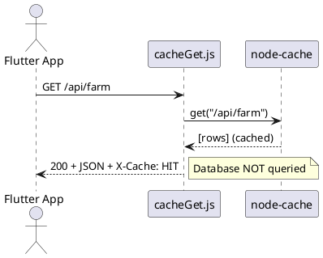
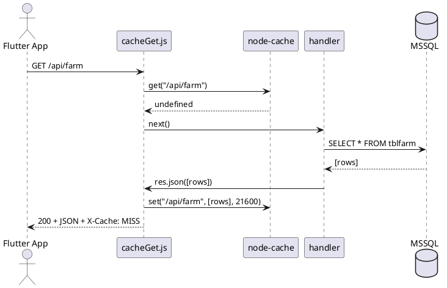

# Sprint-Sync-Caching — Technical Design

**Author**: Architect (Solution Architect)
**Sprint**: Sprint-Sync-Caching
**Branch**: MDAG-339
**Repos**: DAR_Middleware (Node/Express, MSSQL via Knex) · main_dar_app (Flutter, Hive)

---

## 1. Architecture Overview — Cache-Aside Middleware

### Pattern

A **cache-aside** (read-through) Express middleware intercepts GET requests on data-sync endpoints. On cache hit, the middleware short-circuits the handler and returns the cached JSON response with appropriate headers. On cache miss, the handler executes normally and the middleware captures the response body, storing it in cache with a per-endpoint TTL.

```
┌──────────┐     GET /api/farm     ┌────────────────┐    HIT    ┌────────────┐
│  Flutter  │ ──────────────────▶  │  cacheGet.js   │ ───────▶  │  In-memory │
│   App     │ ◀──────────────────  │  (middleware)   │ ◀───────  │   store    │
└──────────┘    200 + JSON         └────────────────┘           └────────────┘
                                          │ MISS
                                          ▼
                                   ┌────────────────┐
                                   │  data_sync/*   │
                                   │  (handler)     │
                                   │  db('table')   │
                                   └───────┬────────┘
                                           │ res.json(rows)
                                           ▼
                                   Store in cache (TTL)
                                   Return to client
```

### Why in-memory (not Redis)?

- DAR_Middleware is a **single-process** Node/Express app deployed to one VM.
- Data volume is small (hundreds to low thousands of rows per table).
- No horizontal scaling requirement today.
- `node-cache` provides TTL, key eviction, stats, and flush — zero infrastructure.
- If the deployment moves to multiple instances, swap `cacheClient.js` to Redis with no middleware changes.

---

## 2. New Files

### Backend (DAR_Middleware)

| File | Purpose |
|------|---------|
| `services/cacheClient.js` | Singleton `node-cache` instance with default TTL, stats exposure, and `bustByPrefix` helper |
| `config/cacheTtl.js` | TTL map per route prefix; single source of truth |
| `middleware/cacheGet.js` | Express middleware: check cache → return or passthrough → intercept `res.json` → store |

### Frontend (main_dar_app)

No new files — changes are in existing files:

| File | Change |
|------|--------|
| `home_sync.dart` | Group sequential awaits into parallel `Future.wait` batches |
| `fruit_care_repository.dart` | Replace `await box.add(item)` loop with `await box.addAll(list)` |
| `other_operations_repository.dart` | Replace `await box.add(item)` loop with `await box.addAll(list)` |

---

## 3. Cache Key Strategy

**Key** = `req.originalUrl`

```
/api/farm
/api/employee-list
/api/fruit-care-sync/areas/all
/api/other-operations-sync/parcels/all
/api/incentive?opcode=25
```

- `originalUrl` includes query strings, so `/api/incentive?opcode=25` and `/api/incentive?opcode=30` are distinct cache entries.
- Only GET requests are cached. POST/PUT/DELETE pass through unconditionally.

---

## 4. TTL Table Per Endpoint

### Static Master Data (TTL: 6 hours = 21 600 s)

| Route prefix | Table(s) | Rationale |
|-------------|----------|-----------|
| `/api/holidays` | `tblholiday` | Changes annually |
| `/api/location` | `tblLocation` | Farm list, rarely edited |
| `/api/disease` | `tbldisease` | Static reference |
| `/api/farm` | `tblfarm` | Rarely changes |
| `/api/layout` | `tbllayout` | Rarely changes |
| `/api/parcel` | `tblparcel` | Rarely changes |
| `/api/material` | `tblmaterial` | Static reference |
| `/api/variety` | `tblvariety` | Static reference |
| `/api/fertilizer-type` | `tblferttype` | Static reference |
| `/api/operation-config` | `tbloperation` | Rarely changes |
| `/api/mixing-operations` | mixed | Rarely changes |
| `/api/chem-mixing` | `tblchemmixing` | Rarely changes |
| `/api/hectarage-area` | `tbl_hectarageArea` | Rarely changes |
| `/api/hectarage-mps` | `tbl_hectarageMPS` | Rarely changes |

### Semi-Static Data (TTL: 15 minutes = 900 s)

| Route prefix | Table(s) | Rationale |
|-------------|----------|-----------|
| `/api/employee-list` | `tblemployee` | New hires/terminations happen but not hourly |
| `/api/fertilizer-materials` | mixed | Occasional updates |
| `/api/fertilizer-cost-center` | mixed | Occasional updates |
| `/api/incentive` | `tblincentive` | Periodic adjustments |

### Bulk Sync Data (TTL: 15 minutes = 900 s)

| Route prefix | Table(s) | Rationale |
|-------------|----------|-----------|
| `/api/fruit-care-sync` | `tbl_hectarageMPS` + `tbl_hectarageArea` + `tbloperation` | 3-join queries are the most expensive |
| `/api/other-operations-sync` | `tblparcel` + `tblhectarage` | Same rationale |

### Volatile / No Cache (TTL: 60 s)

| Route prefix | Rationale |
|-------------|-----------|
| `/api/accounts` | User-specific, session-dependent |
| `/api/batch-numbers` | Transactional, changes frequently |
| `/api/doc-numbers` | Transactional, changes frequently |
| `/api/users` | Auth-adjacent, low volume |

### Never Cache

| Route prefix | Rationale |
|-------------|-----------|
| `/queue/*` | Write-path, never cache |
| `/sendDARForm/*` | Write-path, never cache |

---

## 5. Invalidation Approach

### Phase 1: TTL-Only (Sprint Scope)

- Cache entries expire naturally by TTL.
- No explicit invalidation on data mutations.
- Worst-case staleness = TTL value.
- Admin can force-flush via `POST /api/cache/flush`.

### Phase 2: Manual Bust (Future)

When admin CRUD endpoints are added:

```js
const { bustByPrefix } = require('../../services/cacheClient');
bustByPrefix('/api/farm');
```

### Server Restart

Process restart clears all cache. Acceptable given single-VM deployment.

---

## 6. Implementation Details

### 6.1 `services/cacheClient.js`

```js
const NodeCache = require('node-cache');
const logger = require('../logger');

const cacheClient = new NodeCache({
  stdTTL: 900,
  checkperiod: 120,
  useClones: false,
  maxKeys: 200,
});

cacheClient.on('expired', (key) => {
  logger.info(`Cache expired: ${key}`);
});

function bustByPrefix(prefix) {
  const keys = cacheClient.keys().filter(k => k.includes(prefix));
  if (keys.length > 0) {
    cacheClient.del(keys);
    logger.info(`Cache busted ${keys.length} keys matching: ${prefix}`);
  }
}

function getStats() {
  return cacheClient.getStats();
}

module.exports = { cacheClient, bustByPrefix, getStats };
```

### 6.2 `config/cacheTtl.js`

```js
const HOUR = 3600;
const MINUTE = 60;

const cacheTtl = {
  '/api/holidays':              6 * HOUR,
  '/api/location':              6 * HOUR,
  '/api/disease':               6 * HOUR,
  '/api/farm':                  6 * HOUR,
  '/api/layout':                6 * HOUR,
  '/api/parcel':                6 * HOUR,
  '/api/material':              6 * HOUR,
  '/api/variety':               6 * HOUR,
  '/api/fertilizer-type':       6 * HOUR,
  '/api/operation-config':      6 * HOUR,
  '/api/mixing-operations':     6 * HOUR,
  '/api/chem-mixing':           6 * HOUR,
  '/api/hectarage-area':        6 * HOUR,
  '/api/hectarage-mps':         6 * HOUR,
  '/api/employee-list':         15 * MINUTE,
  '/api/fertilizer-materials':  15 * MINUTE,
  '/api/fertilizer-cost-center':15 * MINUTE,
  '/api/incentive':             15 * MINUTE,
  '/api/fruit-care-sync':       15 * MINUTE,
  '/api/other-operations-sync': 15 * MINUTE,
  '/api/accounts':              60,
  '/api/batch-numbers':         60,
  '/api/doc-numbers':           60,
  '/api/users':                 60,
};

const NO_CACHE_PREFIXES = ['/queue', '/sendDARForm'];

function getTtlForUrl(url) {
  if (NO_CACHE_PREFIXES.some(p => url.startsWith(p))) return 0;
  const match = Object.keys(cacheTtl)
    .sort((a, b) => b.length - a.length)
    .find(prefix => url.startsWith(prefix));
  return match ? cacheTtl[match] : 0;
}

module.exports = { cacheTtl, NO_CACHE_PREFIXES, getTtlForUrl };
```

### 6.3 `middleware/cacheGet.js`

```js
const { cacheClient } = require('../services/cacheClient');
const { getTtlForUrl } = require('../config/cacheTtl');
const logger = require('../logger');

function cacheGet(req, res, next) {
  if (req.method !== 'GET') return next();

  const ttl = getTtlForUrl(req.originalUrl);
  if (ttl === 0) return next();

  const key = req.originalUrl;
  const cached = cacheClient.get(key);

  if (cached !== undefined) {
    logger.info(`Cache HIT: ${key}`);
    res.set('X-Cache', 'HIT');
    return res.status(200).json(cached);
  }

  logger.info(`Cache MISS: ${key}`);
  res.set('X-Cache', 'MISS');

  const originalJson = res.json.bind(res);
  res.json = (body) => {
    if (res.statusCode === 200) {
      cacheClient.set(key, body, ttl);
    }
    return originalJson(body);
  };

  next();
}

module.exports = cacheGet;
```

### 6.4 Mount in `server.js`

```js
const cacheGet = require('./middleware/cacheGet');
app.use(cacheGet);
```

---

## 7. Frontend Optimizations

### 7.1 Parallel Sync Groups (`home_sync.dart`)

```dart
// GROUP 1: Static + semi-static master data
await Future.wait([
  HolidayRepository.syncHolidays(),
  LocationRepository.syncLocations(),
  DiseaseTypeRepository.syncDiseaseTypes(),
  // ... 10+ more
]);

// GROUP 2: Bulk spatial data
await Future.wait([
  FruitCareRepository.syncFruitCareData(),
  OtherOperationsRepository.syncOtherOperationsData(),
]);

// GROUP 3: Volatile / user-specific
await Future.wait([
  UserRepository.syncUsers(),
  AccountRepository.syncAccounts(),
  BatchNumberRepository.syncBatchNumbers(),
  DocNumberRepository.syncDocNumbers(),
]);
```

### 7.2 Batch Hive Writes

```dart
// Before:
for (var areaJson in areasJson) {
  final area = FruitCareArea.fromJson(areaJson);
  await areasBox.add(area);
}

// After:
final areas = areasJson.map((j) => FruitCareArea.fromJson(j)).toList();
await areasBox.addAll(areas);
```

---

## 8. ETag / 304 Support (Phase 2 — Optional)

Deferred to a future sprint. TTL-based caching delivers the bulk of the performance gain. ETag would add value primarily on network transfer, which is secondary to MSSQL query cost.

---

## 9. Sequence Diagrams

### 9.1 Cache Hit



### 9.2 Cache Miss



---

## 10. Non-Functional Requirements

### Performance Targets

| Metric | Current (est.) | Target |
|--------|---------------|--------|
| Full sync wall-clock time | ~25–40 s | ≤ 8 s (warm cache) |
| Cached endpoint response | 200–800 ms | ≤ 15 ms |
| Cache hit rate (steady state) | 0% | ≥ 85% |
| Fruit Care bulk Hive write | ~3–5 s (row-by-row) | ≤ 500 ms |

### Memory Bounds

| Constraint | Value |
|-----------|-------|
| `maxKeys` | 200 |
| Estimated cache memory | ≤ 50 MB |
| Node heap headroom | Process ≤ 256 MB RSS |

### Observability

- `X-Cache` response header on every cached response
- Winston log on every hit, miss, expiration, bust
- `/api/cache/stats` endpoint
- Flutter logs: group sync duration, per-repository duration

---

## 11. Dependencies Between Backend and Frontend

Backend and frontend changes are **fully independent**:

- Backend can be deployed first with zero Flutter changes — same API contract.
- Frontend changes work with or without the backend cache — parallel sync and `addAll()` are purely client-side.
- No cross-repo coordination risk.

### Execution Order

1. Backend: `npm install node-cache` → create 3 files → mount middleware → deploy
2. Frontend: batch Hive writes → parallel sync → progress dialog → build APK

Both streams can proceed in parallel by different squads.
